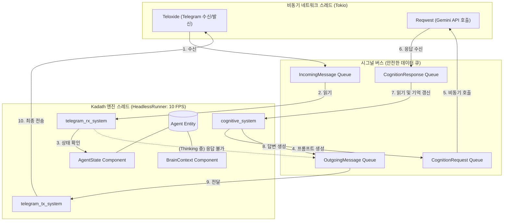

# Kadath Engine Phase 1: Architecture & Integration Plan

이 문서는 라즈베리 파이 데몬(Daemon) 환경에서 텔레그램과 제미나이 API를 통합하는 Phase 1 목표를 달성하기 위해, 현재 구현된 `kadath` 코어를 어떻게 활용하고 변경해야 하는지 분석한 아키텍처 계획입니다.

## User Review Required

> [!IMPORTANT]
> 구성 요소 간의 상호작용 순서도를 추가했습니다. 흐름이 의도하신 바와 일치하는지 확인해 주세요.
> **승인(Approval)을 내려주시기 전까지는 어떠한 실제 코드 구현이나 파일 수정도 진행하지 않고 대기하겠습니다.**

---

## 🔄 구성 요소 상호작용 흐름도 (Architecture Flow)

아래는 비동기 네트워크 스레드(Tokio)와 동기 코어 엔진(Kadath)이 시그널(Signals)을 매개체로 어떻게 상호작용하는지 보여주는 아키텍처 다이어그램입니다.

### 📝 작동 시나리오 설명

1. **평상시 대기 (Idle):**
   * 엔진 스레드는 1초에 10번씩 틱(Tick)을 돌며 `InMsg` 큐에 새 메시지가 있는지 확인합니다.
2. **사용자 메시지 수신:**
   * 비동기 스레드(Teloxide)가 메시지를 받아 `InMsg` 큐에 넣습니다.
   * 엔진의 `telegram_rx_system`이 이를 발견하고 `AgentEntity`의 `AgentState`를 확인합니다.
3. **제미나이 뇌가동 (Thinking):**
   * 현재 상태가 `Idle`이므로, `AgentState`를 `Thinking`으로 바꿉니다.
   * `cognitive_system`은 `BrainContext`의 과거 대화 기억을 덧붙여 `CogReq(질의)` 시그널을 만듭니다.
   * 비동기 스레드(Reqwest)가 이를 낚아채어 제미나이 서버로 전송합니다. API 대기 시간 동안 비동기 스레드만 멈춰있고, 엔진 스레드는 계속 박동(Tick)을 유지합니다.
4. **생각 중 추가 메시지 수신 시 (응답 불가 처리):**
   * API 응답이 오기 전에 사용자가 또 메시지를 보냅니다.
   * `telegram_rx_system`이 확인해 보니 상태가 이미 `Thinking`입니다.
   * 즉시 "현재 생각 중입니다..."라는 텍스트를 `OutMsg`에 넣습니다. `telegram_tx_system`을 거쳐 비동기 스레드가 즉시 사용자에게 경고 메시지를 보냅니다. (제미나이 호출 생략)
5. **최종 응답 전송:**
   * 제미나이 API 응답이 도착하여 `CogRes` 큐에 들어옵니다.
   * `cognitive_system`이 이를 읽어 `BrainContext`에 기억을 추가하고, 상태를 다시 `Idle`로 바꾼 뒤 `OutMsg` 큐에 최종 답변을 넣습니다.
   * 비동기 스레드가 이를 가져가 텔레그램 사용자에게 전송합니다.

---

## 🛠 마일스톤별 통합 설계 및 검토 (Proposed Changes)

### 1. Milestone 1: 샌드박스 인프라 구축 (환경 세팅)
*   **새로운 크레이트:** 기존 워크스페이스에 `crates/agent_daemon` (바이너리) 추가.
*   **추가 의존성:** 환경 변수 로딩을 위해 `dotenvy` 크레이트 추가.

### 2. Milestone 2: 텔레그램 리액티브 루프 (네트워크와 엔진의 분리)
*   **아키텍처 결정 (Sync Runner + Async Worker):**
    *   로보틱스로의 확장을 고려하여 코어 엔진은 순수 동기 루프(HeadlessRunner)로 놔둡니다.
    *   `tokio` 비동기 워커 스레드를 별도로 띄워 텔레그램 I/O를 전담합니다.
    *   두 스레드 간의 통신은 Kadath의 `Signals(Arc<RwLock>)` 버스를 통해 메시지를 주고받습니다.
*   **시스템 구성:** `telegram_rx_system`, `telegram_tx_system`.

### 3. Milestone 3: 제미나이 '뇌' 이식 (상태 관리 및 AI 연동)
*   **추가 의존성:** `reqwest`, `serde`, `serde_json`
*   **상태 머신 (Thinking 대응 로직):**
    *   제미나이 API 응답 대기 중에는 에이전트의 상태를 `AgentState::Thinking`으로 전환합니다.
    *   이 상태에서 텔레그램 메세지가 수신되면 즉시 예외 응답 메시지를 반환하도록 로직을 구현합니다.

### 4. Milestone 4: 데몬화 및 운영 환경
*   **로깅 파이프라인:** 기존 `println!` 하드코딩을 제거하고 `tracing` 기반으로 교체.
*   **데몬화:** 백그라운드 환경에서 HeadlessRunner가 크래시 없이 실행되도록 구성.

---

## 🏷️ 네이밍 사전 검토 (Naming Conventions)

확정된 이름 명세서입니다.

| 구분 | 역할 및 설명 | 확정된 이름 |
| :--- | :--- | :--- |
| **Crate** | 데몬 실행을 위한 메인 실행 파일 공간 | `agent_daemon` |
| **Entity** | 봇 자신을 나타내는 물리적/논리적 객체 | `AgentEntity` |
| **Component** | 제미나이 API 키, 히스토리, 모델 설정 | `BrainContext` |
| **Component** | 현재 봇의 상태 (Idle, Thinking, Error) | `AgentState` |
| **Signal** | 텔레그램에서 들어온 사용자의 메시지 | `IncomingMessage` |
| **Signal** | 텔레그램으로 내보낼 답변 (또는 시스템 응답) | `OutgoingMessage` |
| **Signal** | 제미나이 API에 질의할 프롬프트 데이터 | `CognitionRequest` |
| **Signal** | 제미나이 API 처리 완료 후 반환된 텍스트 | `CognitionResponse` |
| **System** | 텔레그램 수신 시그널을 확인하는 시스템 | `telegram_rx_system` |
| **System** | 텔레그램 송신 시그널을 처리하는 시스템 | `telegram_tx_system` |
| **System** | 제미나이 상태를 업데이트하고 질의하는 시스템 | `cognitive_system` |

---

## Verification Plan

1. **컴파일 및 단위 테스트:** `tokio` 스레드와 `HeadlessRunner`가 충돌 없이 동시에 실행되는지 검증.
2. **로컬 에코 & 예외 테스트:** 봇에게 말을 걸고 "Thinking" 중일 때 다시 말을 걸어 "응답 불가" 메시지가 정상 출력되는지 확인.
3. **제미나이 연동 테스트:** 간단한 질문을 던져 제미나이 파이프라인이 정상 동작하는지 확인.
